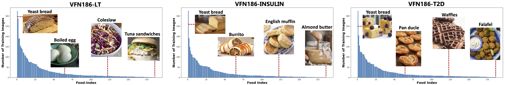

# VFN186 Food Image Datasets [IEEE Transaction on Multimedia 2025] 

This repository contains the **VFN186 food image dataset** that is introduced in **Long-Tailed Continual Learning For Visual Food Recognition** 

We provide the full VFN186 dataset and also its long-tailed variants, which show the real food consumption patterns of 3 populations including (1) healthy people, (2) Type-1 diabetes (Insulin Taker), and (3) Type-2 diabetes (without taking insulin). 

The full dataset can be downloaded [[here]](https://drive.google.com/file/d/1Exi8Mw62nF8vS44HkvOwlybrRxqIFauY/view)



## Dataset Structure:
```
VFN186/
├── cropped_new/               # Single food images for all 186 food classes
│   ├── [food_type_1] ==  label/         # Each subfolder is named as food type == (label)
│   ├── [food_type_2] ==  label/
│   └── ...
├── full_data_list.txt         # Complete listing of original VFN186 data
├── new_food_list_186_cf.xlsx  # Spreadsheet with FNDDS codes and consumption frequencies
└── train_test_files/          # Simulated "long-tailed" distribution training files
```
